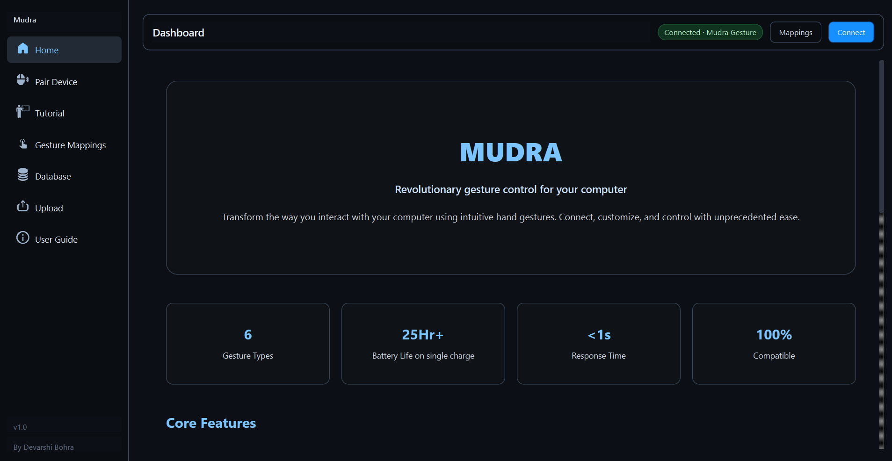
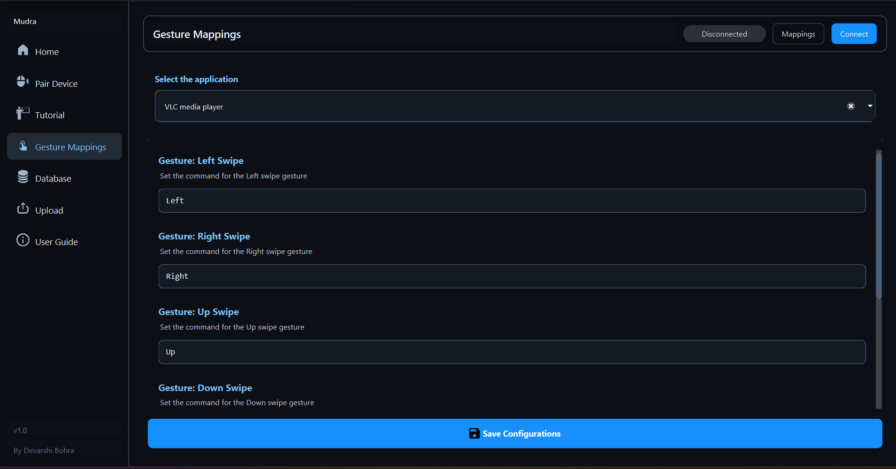
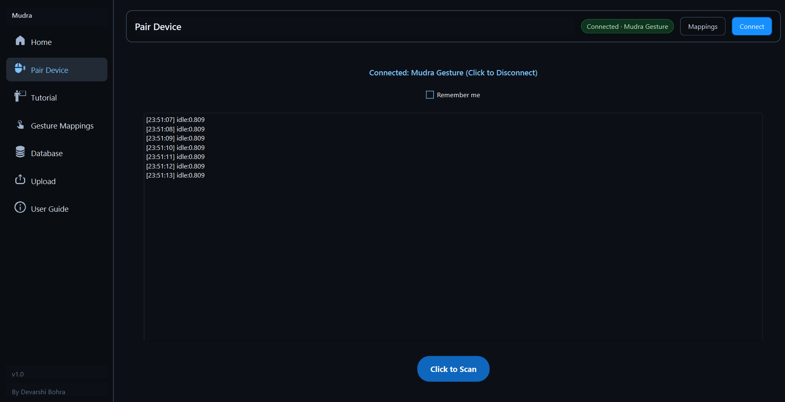

# Mudra

Mudra Ring is a **gesture-controlled wearable mouse** that makes interacting with your computer more natural and intuitive.  
The name Mudra comes from Sanskrit, meaning hand positions, which reflects the device’s core principle of using hand movements for control.  
This desktop application allows you to **map gestures to specific applications** (e.g., VLC, PowerPoint, Zoom) and manage your Mudra device easily.

This project integrates **Data Engineering** and **AI/ML models**, forming a complete **Data Science pipeline**.  

---

## ✨ Features  

- 🖱️ **Seamless Mouse Control** – Use Mudra as a wireless mouse.  
- ✋ **Gesture Recognition** – Control apps with six intuitive hand gestures.  
- ⚙️ **Customizable Mappings** – Choose what each gesture should do using the app.  
- 🔄 **Left & Right-Hand Support** – Select firmware according to your preference.  
- 🔋 **Battery Percentage** – View real-time battery level in the Bluetooth terminal.  
- ⚡ **Plug & Play** – No drivers or setup required.  

---

## 📥 Download & Install  

1. Go to the [Releases](https://github.com/DevarshiBohra/Mudra-Ring/releases/tag/v1.0.0) section.  
2. Download the latest `Mudra.exe` file.   

---

## 🚀 How to Use  

1. Open the `Mudra-Setup.exe` application.
2. Power on your **Mudra device** and connect via Bluetooth. 
3. Select your preferred **gesture mappings** for applications.  
4. Start controlling your PC with **gestures + mouse functionality**.  

---

## 📸 Screenshots  

### Home Screen  
 

### Gesture Mapping Screen  

### Pair Screen

---

## 🔮 Future Updates  

- More gesture options    
- Cross-platform support (Mac, Linux)  

---

## ❓ Support  

If you face any issues or have suggestions, please raise them in the **[Issues](https://github.com/DevarshiBohra/Mudra-Ring/issues)** section.  

---
